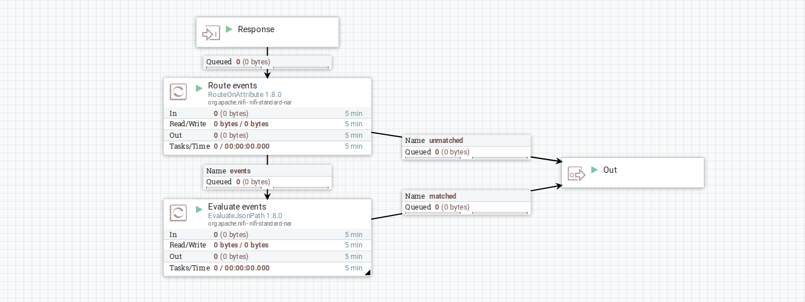

## Getting OpenSRP Entities

In this document we describe the flow for getting OpenSRP entities and how this interacts with the state machine.

This processor group can be used to pull entities from OpenSRP. It does this mainly by hitting the `/getAll` endpoint with a serverVersion to get the latest entities.
The main layout is as shown below

Usually the processor sending flowFiles to the `Start` input port above is a GenerateFlowFile processor. There is where you want to set a schedule for how often you want to be pulling entities from OpenSRP.

To fully understand what is going on, we will follow a flowFile through the process

- Once the first flowFile is generated it comes in through the input port `Start` above and moves to the `OpenSRP ETL State` processor group through the `query` input port in the diagram below

- This is always the first entry point for all new flowFiles.
- In the `Set Query Action` UpdateAttribute processor, the `stateAction` attribute is set to `query`
- The flowFile then moves on to the `ETL State Update Machine` UpdateAttribute processor where there are a couple of rules as shown below

- Since this is the first flowFile, the first rule `Init State` confirms that the `stateInitialized` attribute is indeed empty, therefore setting values for `state: 0`, `stateInitialized: 1`, `stateQueryCount: 0` and `stateUpdateCount: 0` as shown above
- The flowFile then moves on to `Check Concurrent Requests`. This is where we determine if the flowFile should be routed to continue or wait.
- In order to continue, our flowFile needs to meet the following condition `${stateAction:equals("query"):and( ${stateQueryCount:equals(${stateUpdateCount})} )}`. Since it does, it proceeds to the `state` output port, exiting the processor group and into the `Hit OpenSRP endpoint` invokeHTTP processor
- A GET request is made to `${openSRPBaseURL}/${dataType}/getAll?serverVersion=${state}&limit=${responseLimit}${extraParams}`. The state was set to 0 in the processor group above, while all the other variables are set in the environment. `openSRPBaseURL` is the base url, `dataType` is the object you want to get e.g `plan`, `event`, `location` or `task`. `responseLimit` is the number limit of entities you want returned while `extraParams` is any extra filters that you would like to add

- If this request is successful we get a response which moves on to the `Evaluate events` processor group. This processor group is shown below

- The main purpose of the above processor group is to evaluate events. When we hit the `/getAll` endpoints, the response is usually a list of whatever object we are getting. But with events, the response includes both events and clients. So we need to specifically get the events from this response and discard the clients. In other cases we might want to extract the clients and discard the events. For all other object types the response is simply routed to the output.

- On exiting the `Evaluate Events` processor group, one flowFile is routed to the output port, to proceed with further processing or storage, while another flowile is routed to the `Extract Max ServerVersion` shown below. All entities are routed through this processor but only `Events` are evaluated.

- `Get Server Versions` extracts all the server versions from the response into a flowFile attribute called `serverVersions`
- In `Get Max serverVersion` we then update the `max serverVersion` to `${serverVersions:jsonPath("$.max()"):toRadix(10)}` and update the `state` to `${serverVersions:jsonPath("$.max()"):isEmpty():not():ifElse( ${serverVersions:jsonPath("$.max()"):plus(1):toRadix(10)}, ${state})}` [ this state is what will be used as the serverVersion for the next request ]
- If the response was empty, no serverVersions will be found in the `Get Server Versions` processor and the flowFile will be routed to the output through failure. This way the state / serverVersion is not changed and the next time a request is made, it will use the same serverVersion
- Our flowFile then flows back into the `OpenSRP ETL State` processor group through the `update` input port where the `stateAction` attribute is set to `update`
- When our flowFile moves into the `ETL State Update Machine` for the second time, the `Update State` rule passes and the attributes shown below are updated

- Note that the state remains the same, with the value being the max serverVersion
- When this flowFile moves on to `Check Concurrent Requests`, it does not match either routing conditions, it's cycle is complete and thus the flowFile is dropped.

- If another flowFile is generated before the first one completes the cycle, when it gets to the `ETL State Update Machine` the attributes will be updated based on the `Query State` rule as below

- On reaching the `Check Concurrent Requests`, because this flowFile matches the conditions `${stateAction:equals("query"):and( ${stateQueryCount:equals(${stateUpdateCount}):not()} )}` it is routed to wait for update until the first flowFile completes the cycle.

- Until a flowFile is able to flow to the `state` output port, it might go through the `ETL State Update Machine` a couple of times following the `ReQuery State`

- To reset everything, enable the `Manual State Reset` and generate a flowFile. This flowFile goes into the `ETL State Update Machine` through the `reset` input port and in the `ETL State Update Machine` the state is initialized