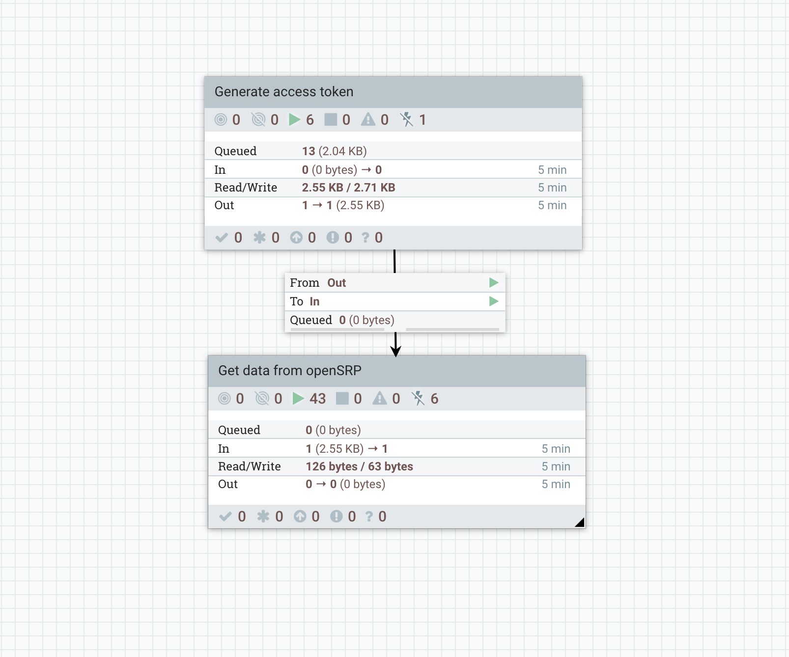
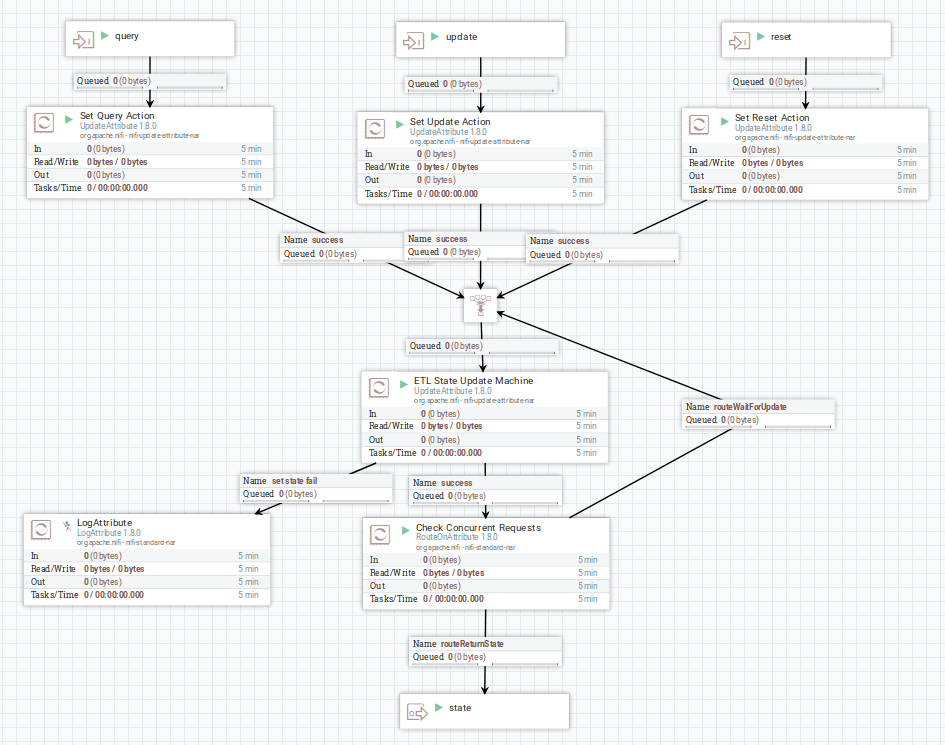
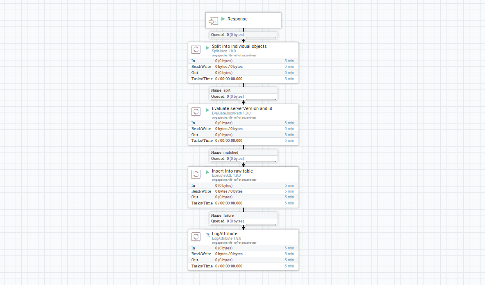

## Ingestion from OpenSRP
The main objective of this processor group is to pull data from OpenSRP and dump it into postgres tables. Any other processing/analysis that needs to be done will be pulling it from the tables.

Each is broken down into two parts, 
1) a `Get Access Token`: process group that schedules the pipeline and gets OpenSRP api authentication
2) a `Get OpenSRP Date` process group that actually gets the data. 

### Get Access Token PG

This PG is responsible for 
1) Scheduling the pipeline. This is set in the `generateFlowFile` processor.
2) Getting an authentication access token from KeyCloak. Once the token is retrieved, the value is evaluated and stored as an attribute to be used downstream when getting the data.

### Get data from OpenSRP PG

The `Get data from OpenSRP` flow is versioned, so after making a change on one you can easily apply the same change to all the other groups by changing the version. Below is an image of what this processor group looks like

#### 1. OpenSRP ETL state

This is mainly where we manage the state or the serverVersion. When a flowfile gets here from the Get Access Token process group, it gets passed in through the `query` input port, where we set the `stateAction` attribute to `query`.
In the `ETL State Update Machine` we update different attributes based on the state of the flowFile coming in. The state could either be `init`, `query`, `reQuery`, `update` or`reset`

A more detailed breakdown of how the State Machine operates can be found [here](getting-opensrp-entities.md)

#### 2. Hit OpenSRP endpoint

To get data from OpenSRP we use the following url
> `${openSRPBaseURL}/${dataType}/getAll?serverVersion=${state}&limit=${responseLimit}${extraParams}`

The variables are all defined within the processor group. The `dataType` is set for the different items that we are pulling such as tasks, locations, events, plans etc

#### 3. Evaluate events

This processor group exists in all flows but is really only needed for the flow pulling in events. Because the events endpoint returns both events and clients, this is where we evaluate the response to get just the events. In all the other flows the response simply passes through unmodified

#### 4. Extract max serverVersion

In order to make the next request to the OpenSRP endpoint, if there is more data, we extract that maximum serverVersion from the response we obtained and update the `state` attribute with the new serverVersion.

This then flows back into the ETL state processor group through the `update` port

#### 5. Save raw data

Here we split the response into individual objects, evaluate the `identifier`, `serverVersion` and `full_json` object, and insert into a postgres table

