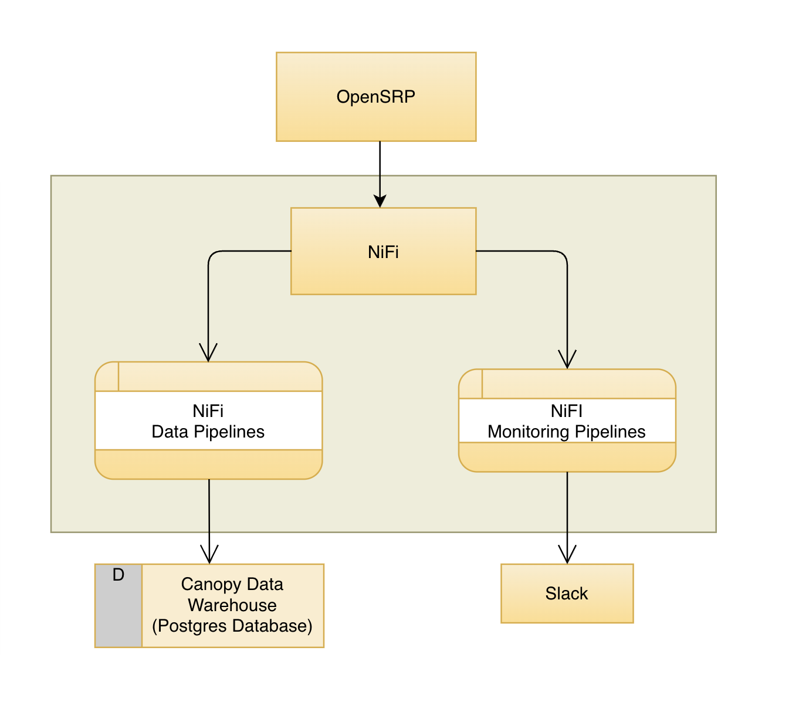

## NiFi Introduction

The primary objective for NiFi within the Reveal setup is to build pipelines for routing and transforming data from the OpenSRP system to the Canopy data warehouse. Nifi provides a graphical user interface where the pipelines are built using directed graphs. 

A detailed intoduction to NiFi can be found [here](https://nifi.apache.org/docs/nifi-docs/html/overview.html). Briefly the main concepts and entities used to build these pipelines are:

1) Flowfiles - This is an abstraction of the data to be processed through the system.
2) Flowfile Processor - These perform specific tasks against the flowfiles. They do the actual work of transforming and moving the data.
3) Connections - These provide linkages between processors.
4) Process Group - This is a set of processors and their connections which are ideally grouped together to achieve a specific logical task.

The [Nifi Expression Language docs](https://nifi.apache.org/docs/nifi-docs/html/expression-language-guide.html) provides more details on flowfiles and how they can can be processed.

### Further Reading

[Developer's Guide](https://nifi.apache.org/docs/nifi-docs/html/developer-guide.html)
