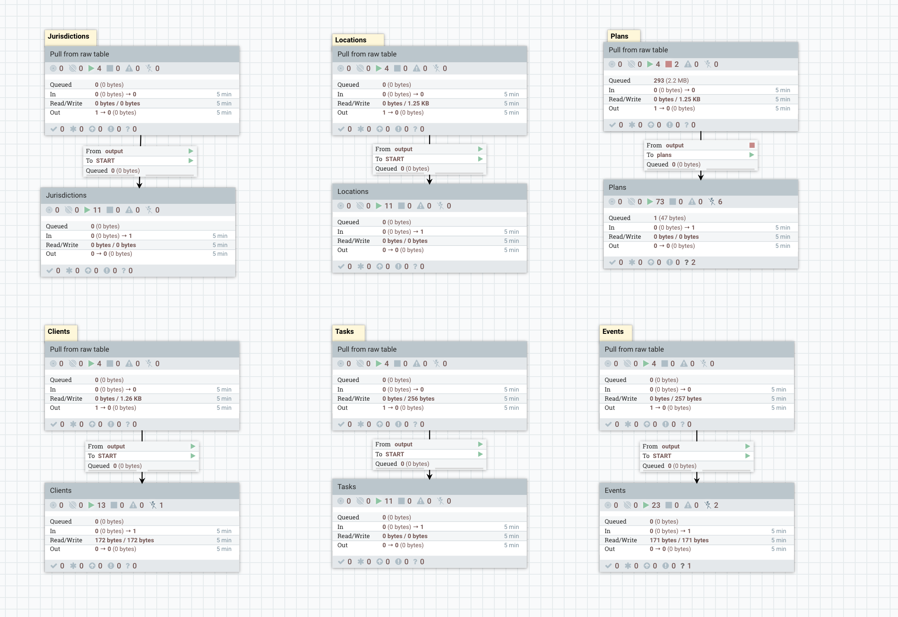

# Process And Store Data PG

This process group is responsible for processing the raw json entities. It flattens the entity json fields into individual columns. Similar to above, separate pipelines exist for the different entities. 

Each entity type is handled independently in separate pipelines. This is shown in the image below

The pipelines have the same design, ie they are composed of two process groups, one that pulls from the raw table and the second PG is designed to push the processed jsons fields into flattened tables. The design for this second PG is dependant on the type of entity being processed. 

Generally, these pipelines do the following: 

1) Fetch data from the raw data tables
2) Evaluates the fields in each raw json
3) Where necessary the data is enriched with calculated fields
4) Build insert statements
5) Runs the insert statements to push the records to the respective entities' flattened tables.

## Pulling Data from the raw table

The structure of this PG is shown below:

