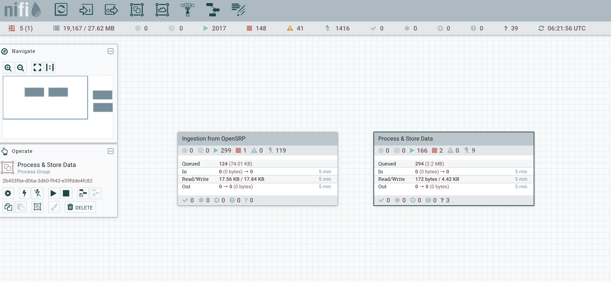
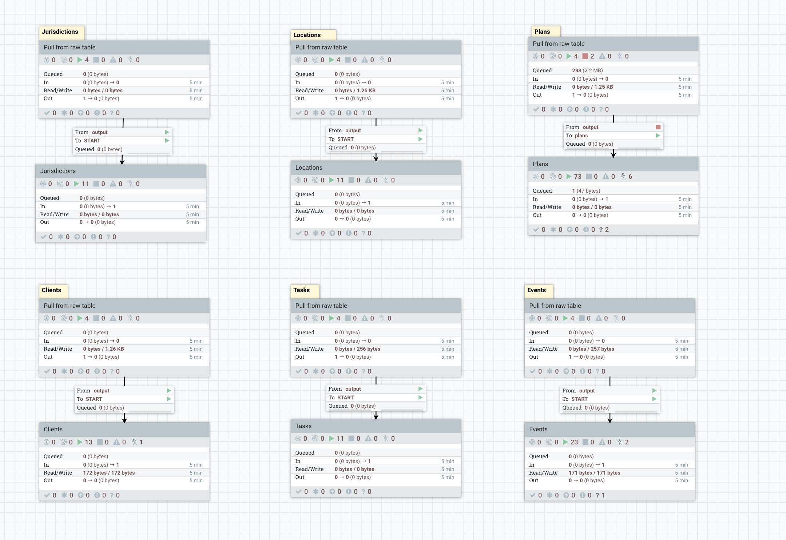

# The Reveal OpenSRP Connector

The Opensrp Connector is responsible for moving data from the OpenSRP's app databases to the Canopy's analytics database. It is composed of two main process groups namely:

1) Ingestion From OpenSRP 
2) Process & Store Data

## Ingestion From OpenSRP

This process group is responsible for pulling the OpenSRP entities from the OpenSRP database and saving them in the Canopy database in the raw json format. The intention of these pipelines is to simply dump what exists in OpenSRP in an unprocessed state.

There exists independent pipelines in the form of process groups for each entity type. The OpenSRP entity types currently being retrieved are:
1) Clients
2) Events
3) Jurisdictions
4) Locations
5) Tasks
6) Plans
7) Organizations
8) Providers

For each of these a separate pipeline exists to push them to their respective raw data tables.

This [documentation](ingestion-from-opensrp.md) gives a breakdown of the pipeline design.

## Process & Store Data

This process group is responsible for processing the raw json entities. It flattens the entity json fields into individual columns. Similar to above, separate pipelines exist for the different entities. 

These pipelines do the following: 
1) Fetch data from the raw data tables
2) Evaluates the fields in each raw json
3) Build insert statements
4) Runs the insert statements to push the records to the respective entities' flattened tables.

