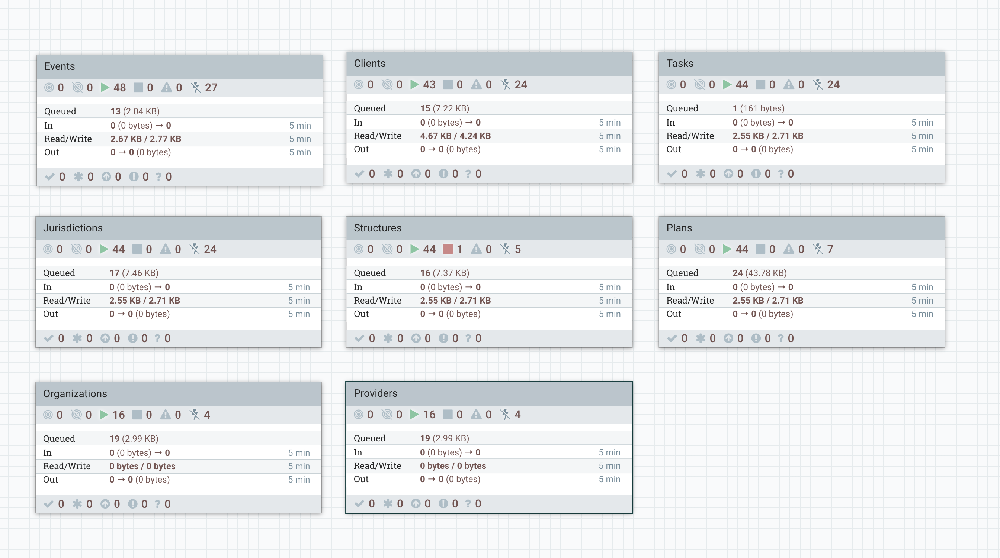

## Ingestion from OpenSRP
The main objective of this processor group is to pull data from OpenSRP and dump it into postgres tables. Any other processing/analysis that needs to be done will be pulling it from the tables.

We currently have five flows which are pretty much the same, each dealing with a different item. Events, Tasks, Jurisdictions, Structures and Plans. Initially this was all being done by the same flow, but it is now separated so that we have more control over each item and so that the failure of one does not hold up everything else in a queue.

Each is broken down into two parts, a generateFlowfile processor and the processor group that actually gets the data. The purpose of the generateFlowfile is to mainly handle the schedule, and the reason why it is outside the processor group is so that we can potentially have different schedules on the different items without affecting the versioned processor group.

The `Get data from OpenSRP` flow is versioned, so after making a change on one you can easily apply the same change to all the other groups by changing the version. Below is an image of what this processor group looks like

#### 1. OpenSRP ETL state

This is mainly where we manage the state or the serverVersion. When a flowfile gets here from the generateFlowfile processor it gets passed in through the `query` input port, where we set the `stateAction` attribute to `query`.
In the `ETL State Update Machine` we update different attributes based on the state of the flowFile coming in. The state could either be `init`, `query`, `reQuery`, `update` or`reset`

#### 2. Hit OpenSRP endpoint

To get data from OpenSRP we use the following url
> `${openSRPBaseURL}/${dataType}/getAll?serverVersion=${state}&limit=${responseLimit}${extraParams}`

The variables are all defined within the processor group. The `dataType` is set for the different items that we are pulling such as tasks, locations, events, plans etc

#### 3. Evaluate events

This processor group exists in all flows but is really only needed for the flow pulling in events. Because the events endpoint returns both events and clients, this is where we evaluate the response to get just the events. In all the other flows the response simply passes through unmodified

#### 4. Extract max serverVersion

In order to make the next request to the OpenSRP endpoint, if there is more data, we extract that maximum serverVersion from the response we obtained and update the `state` attribute with the new serverVersion.

This then flows back into the ETL state processor group through the `update` port

#### 5. Save raw data

Here we split the response into individual objects, evaluate the `identifier`, `serverVersion` and `full_json` object, and insert into a postgres table

